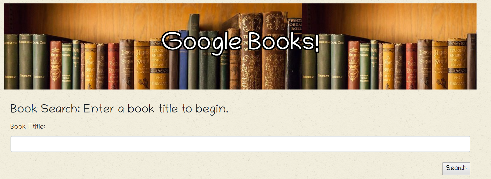
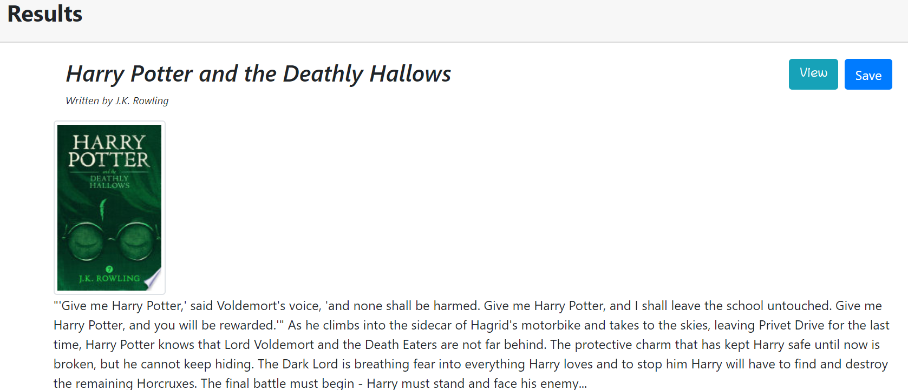
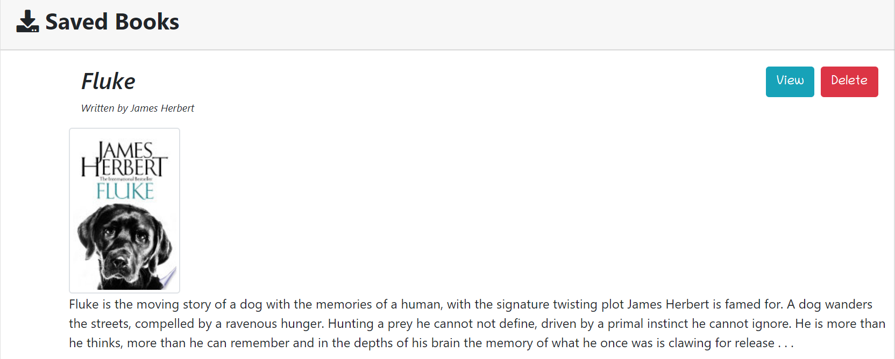

# Google-Books
A full stack MERN application where a user searches for a book calling the Google Books API. The searched books have a link to thier location on Google Books for more information and purchase options. The user can also save a book from thier search. 

https://shrouded-ridge-91767.herokuapp.com/

